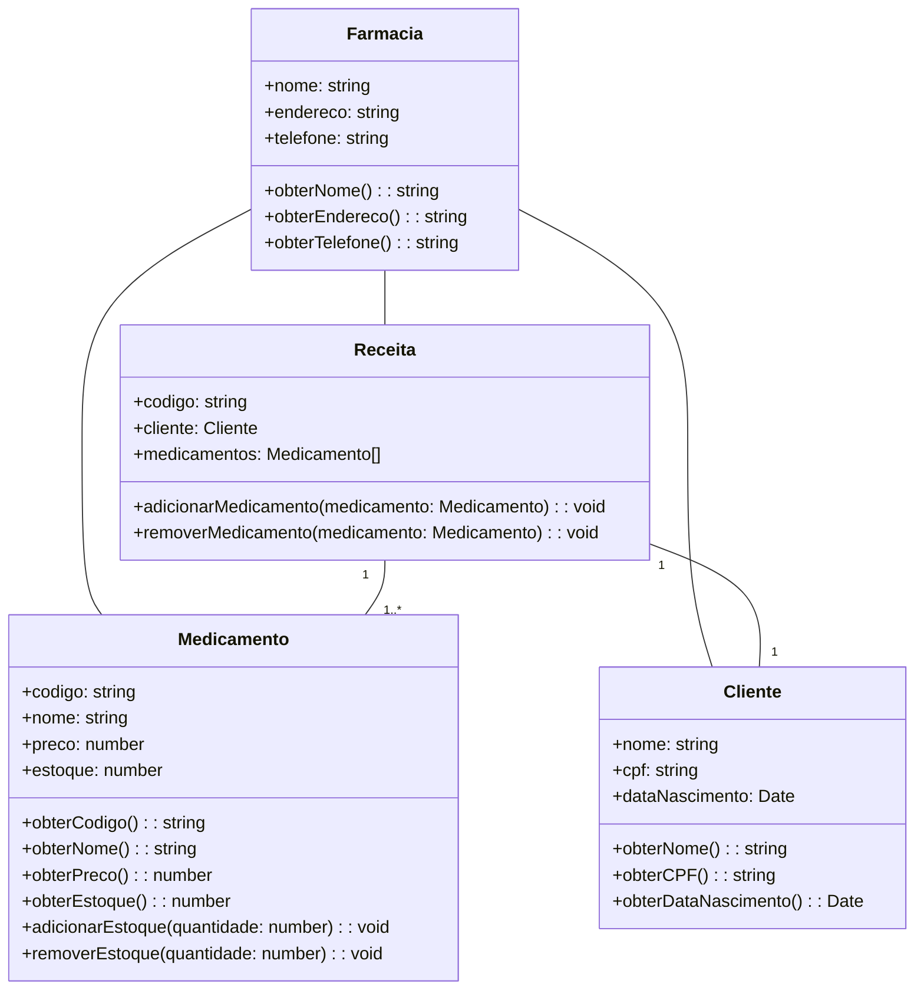

# VitalFarma

Este repositório é sobre um projeto final para a disciplina de Linguagem da Programação,
utilizando todos os conceitos aprendidos no decorrer da disciplina. O projeto consiste
numa farmácia, que aplica conceitos de POO e alguns Design Patterns, bem como boas práticas
para otimização de código.

## Convenções

Umas paradas padronizadas pra facilitar a manutenção do projeto.

### Para variáveis:
- Use sempre ```qtd``` como prefixo de variáveis que guardem quantidades. Ex: ```qtdRemedios```
- Quando criar uma variável que seja uma lista, seu nome deve estar no plural. Ex: ```List<Remedio> remedios;```

### Para métodos:
- Use ações em inglês como sufixo em nome de métodos das classes CRUD. Ex: ```addRemedio()```,```removeRemedio```

## UML do projeto:

